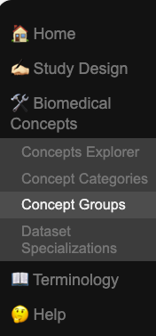
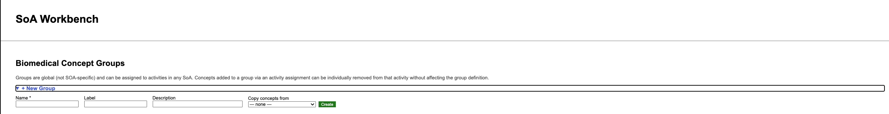
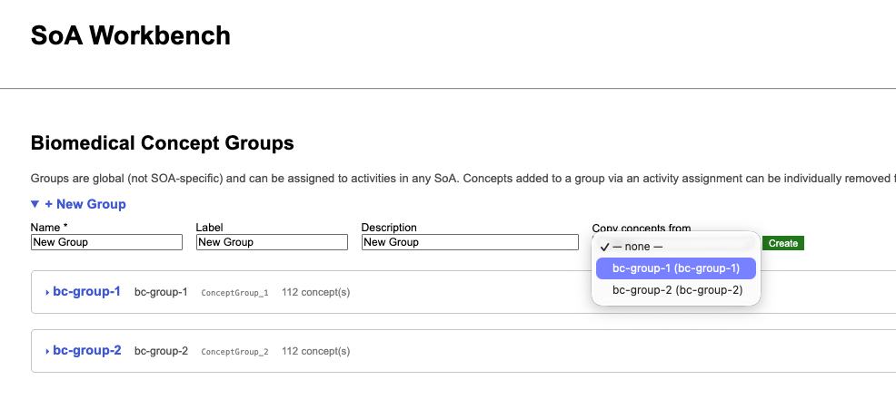
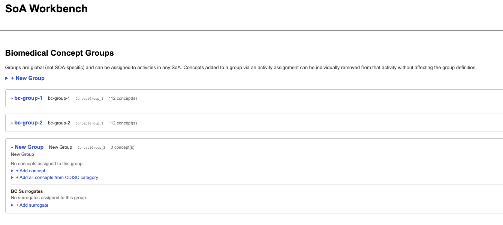
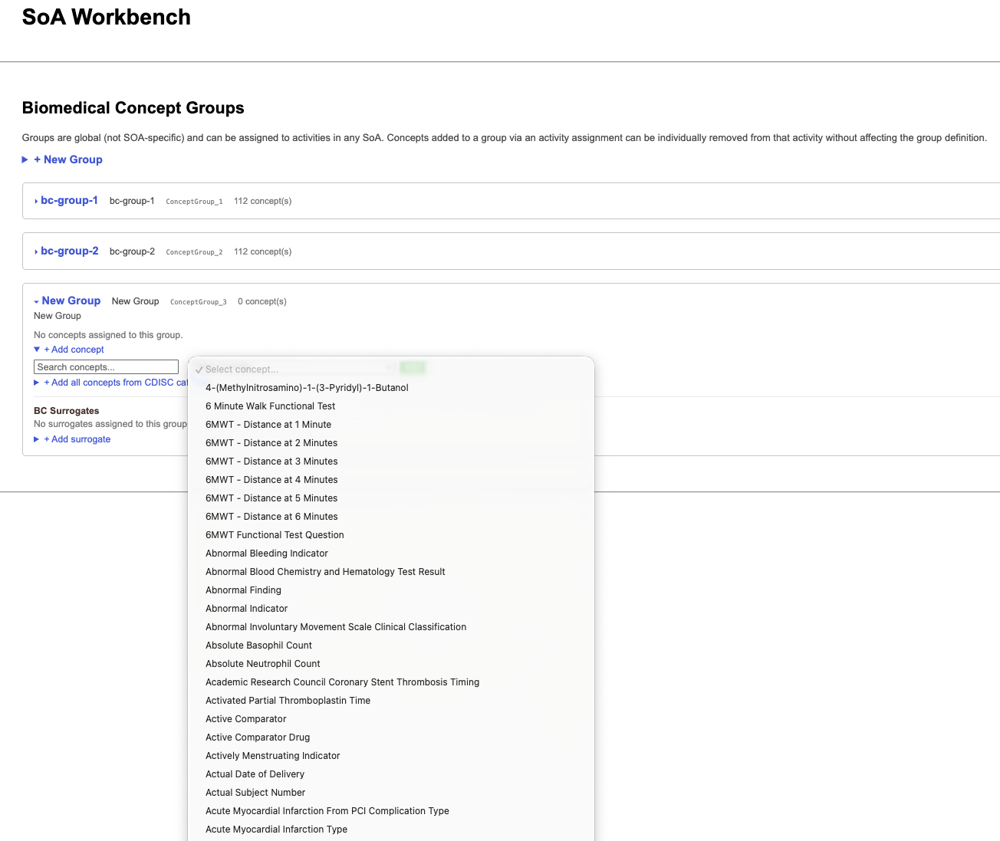
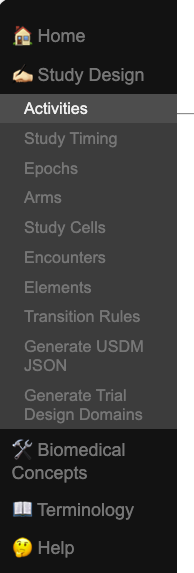
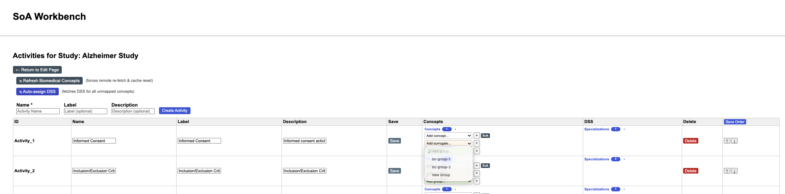
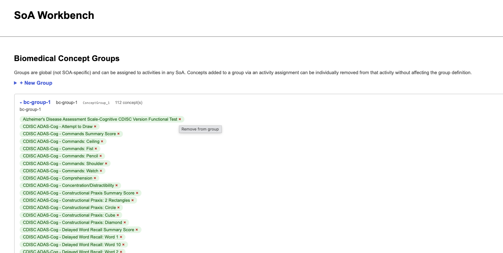
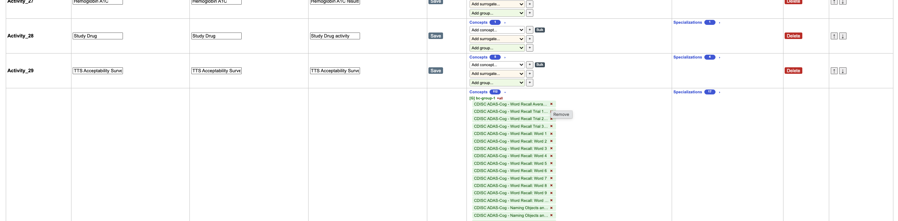
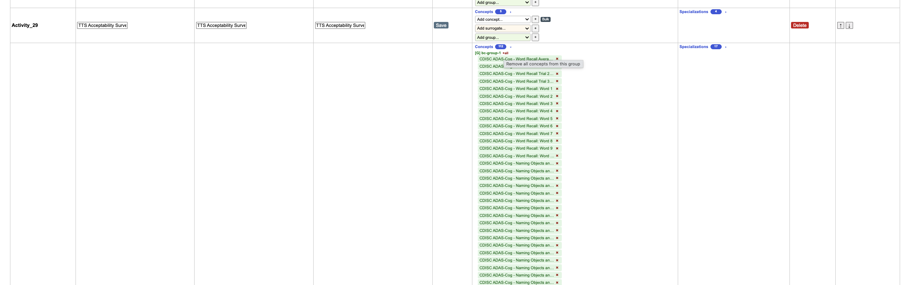

# Biomedical Concept Groupings

- Groupings are a way of 'tagging' Biomedical Concepts so they are associated with one another
- Groupings are created by a user
- Groupings exist at the UX layer
- Groupings exist outside of the scope of an SOA so they can be reused in multiple studies
- Groups of Biomedical Concepts can be assigned to an Activity
- Individual Biomedical Concepts can be removed from a group when assigned to an activity to support further customizations
- Existing groups can be copied to another group to support inheritance and overriding 
- Biomedical Concepts are still automagically mapped to corresponding Data Set Specializations when assigned to an `Activity`

## Create a new group and assign to an activity
1. Select `Biomedical Concepts` > `Concept Groups` from the navigation bar.

2. Select `New Group`.

If there are existing groups, the user can choose to copy the group and `tagged` biomedical concepts.

3. Once the group has been created, the user can `tag` (assign) biomedical concepts to add to the group.

The user can also add an entire Biomedical Concept Category to a new group.

The user can also add a Biomedical Concept Surrogate to the new group.

4. Once created, the user navigates to the `Activities` page for a study.

5. The user can then select a group from the select dropdown for any activity.

## Customize Biomedical Concepts in a group

1. On the `Biomedical Concepts` > `Concept Groups` page, expand a group.

Simply click on the 'x' beside a biomedical concept to remove from the group.

2. On the `Study Design` > `Activities` page, expand an assigned group.

Simply click on the `x` beside a biomedical concept to remove from the group and activity.

## Remove entire group from an Activity

1. On the `Study Design` > `Activities` page, expand an assigned group.

Simply click on the `x all` icon and the group will be unassigned from the activity.

