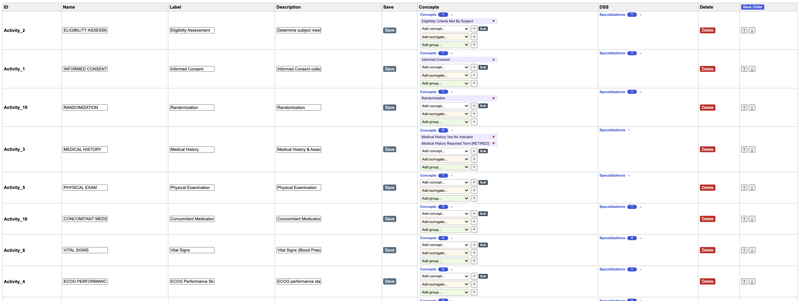
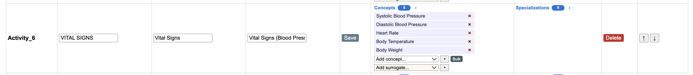
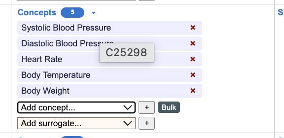
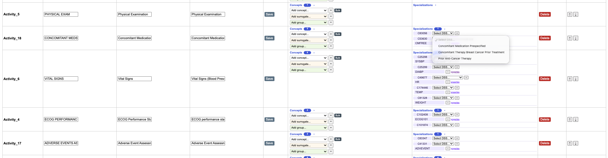
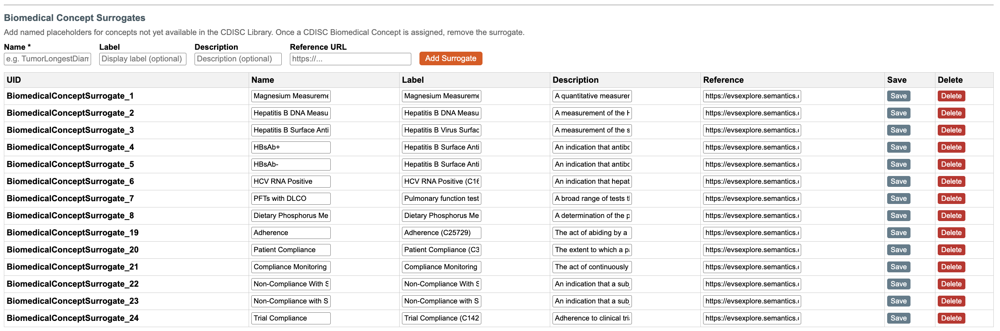
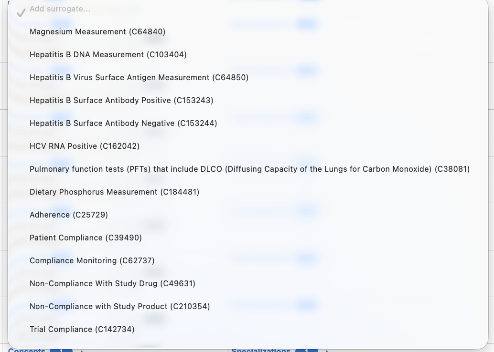
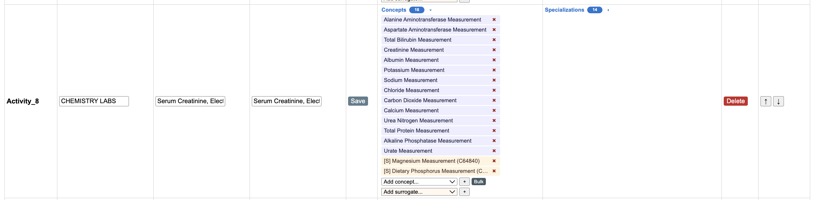

# Workflow for linking Biomedical Concept with Scheduled Activity Instance

Assumes that the Activties and Scheduled Activity Instances have been created to form the SOA Matrix.




## Assign Biomedical Concept to an Activity

Individual Biomedical Concepts can be assigned to an Activity or they can be assigned by Biomedical Concept Group.  




Hovering the cursor over a Biomedical Concept (BC) will display the C code for the BC.



C25298 is the C Code for Systolic Blood Pressure.

In the DSS (Data Set Specialization) column, the SDTM DSS values corresponding to the C Code of the Biomedical Concept are shown in the dropdown next to the biomedical concept C-code.  This is done using the CDISC Library API: https://api.library.cdisc.org/api/cosmos/v2/mdr/specializations/datasetspecializations?biomedicalconcept=C25298



If more than one data set Specialization is associated with a Biomedical Concept, all options are listed in the dropdown.  This is shown in the image above for `Activity_18`, where there are three DSS available for the Biomedical Concept `Concomitant Therapy`, C-code C53630.

## Assign Biomedical Concept Surrogate to an Activity

When a Biomedical Concept does not exist in the Library, there is a facility to create a Surrogate Concept to link to an Activity.

The USDM Implementation Guide describes Biomedical Concept Surrogates as:

_Surrogate BCs are a
placeholder mechanism for when a BC definition is not available. This allows the name of a test to be specified but
no further detail need be provided. Surrogates can contain a name and description pair for the concept required. A
reference field is also provided to allow for links to reference materials (e.g., a URL for an external resource)._

In order to map a Surrogate to an Activity, first create the Surrogate.



Once created, these Surrogates can be added to a Scheduled Activity Instance in the same way as Biomedical Concepts.






These Surrogates are shown in the USDM JSON associated with their Scheduled Activity Instances.

```JSON
{
    "id": "Activity_8",
    "extensionAttributes": [],
    "name": "CHEMISTRY LABS",
    "label": "Serum Creatinine, Electrolytes (K, Na, Cl, CO2), Ca, BUN, Albumin, Total Protein, Phosphorus, AST (SGOT), ALT (SGPT), Alkaline Phosphatase, Total Bilirubin, Magnesium, Uric Acid.",
    "description": "Serum Creatinine, Electrolytes (K, Na, Cl, CO2), Ca, BUN, Albumin, Total Protein, Phosphorus, AST (SGOT), ALT (SGPT), Alkaline Phosphatase, Total Bilirubin, Magnesium, Uric Acid.",
    "previousId": "Activity_24",
    "nextId": "Activity_25",
    "childIds": [],
    "definedProcedures": [],
    "biomedicalConceptIds": [
        "BiomedicalConcept_18",
        "BiomedicalConcept_19",
        "BiomedicalConcept_20",
        "BiomedicalConcept_21",
        "BiomedicalConcept_22",
        "BiomedicalConcept_64",
        "BiomedicalConcept_65",
        "BiomedicalConcept_66",
        "BiomedicalConcept_67",
        "BiomedicalConcept_68",
        "BiomedicalConcept_69",
        "BiomedicalConcept_70",
        "BiomedicalConcept_71",
        "BiomedicalConcept_72"
    ],
    "bcCategoryIds": [],
    "bcSurrogateIds": [
        "BiomedicalConceptSurrogate_1",
        "BiomedicalConceptSurrogate_8"
    ],
    "timelineId": null,
    "notes": [],
    "instanceType": "Activity"
    },
```

```JSON
"bcSurrogates": [
    {
    "id": "BiomedicalConceptSurrogate_1",
    "extensionAttributes": [],
    "name": "Magnesium Measurement",
    "label": "Magnesium Measurement (C64840)",
    "description": "A quantitative measurement of the amount of magnesium present in a sample.",
    "reference": "https://evsexplore.semantics.cancer.gov/evsexplore/concept/ncit/C64840",
    "notes": [],
    "instanceType": "BiomedicalConceptSurrogate"
    },
```
## Using CDISC Library API response to map to USDM JSON.


### CDISC Library API response for C-code C16809 (Magnetic Resonance Imaging), 

```json
{
    "_links": {
        "parentBiomedicalConcept": {
            "href": "/mdr/bc/biomedicalconcepts/C16502",
            "title": "Diagnostic Imaging Testing",
            "type": "Biomedical Concept"
        },
        "parentPackage": {
            "href": "/mdr/bc/packages/2023-12-12/biomedicalconcepts",
            "title": "Biomedical Concept Package Effective 2023-12-12",
            "type": "Biomedical Concept Package"
        },
        "self": {
            "href": "/mdr/bc/biomedicalconcepts/C16809",
            "title": "Magnetic Resonance Imaging",
            "type": "Biomedical Concept"
        }
    },
    "conceptId": "C16809",
    "href": "https://evsexplore.semantics.cancer.gov/evsexplore/concept/ncit/C16809",
    "categories": [
        "Diagnostic Imaging",
        "Medical Imaging"
    ],
    "shortName": "Magnetic Resonance Imaging",
    "synonyms": [
        "Magnetic Resonance",
        "MRI",
        "MRI Scan",
        "NMR",
        "NMR Imaging"
    ],
    "resultScales": [
        "Nominal"
    ],
    "definition": "Imaging that uses radiofrequency waves and a strong magnetic field rather than x-rays to provide detailed pictures of internal organs and tissues. The technique is valuable for the diagnosis of many pathologic conditions, including cancer, heart and vascular disease, stroke, and joint and musculoskeletal disorders.",
    "dataElementConcepts": [
        {
            "conceptId": "C117511",
            "href": "https://evsexplore.semantics.cancer.gov/evsexplore/concept/ncit/C117511",
            "shortName": "Reported Name of Procedure",
            "dataType": "string",
            "ncitCode": "C117511"
        },
        {
            "conceptId": "C117512",
            "href": "https://evsexplore.semantics.cancer.gov/evsexplore/concept/ncit/C117512",
            "shortName": "Standardized Name of Procedure",
            "dataType": "string",
            "ncitCode": "C117512"
        },
        {
            "conceptId": "C25372",
            "href": "https://evsexplore.semantics.cancer.gov/evsexplore/concept/ncit/C25372",
            "shortName": "Category",
            "dataType": "string",
            "ncitCode": "C25372"
        },
        {
            "conceptId": "C25692",
            "href": "https://evsexplore.semantics.cancer.gov/evsexplore/concept/ncit/C25692",
            "shortName": "Subcategory",
            "dataType": "string",
            "ncitCode": "C25692"
        },
        {
            "conceptId": "C171000",
            "href": "https://evsexplore.semantics.cancer.gov/evsexplore/concept/ncit/C171000",
            "shortName": "Prespecified Event or Intervention Indicator",
            "dataType": "boolean",
            "exampleSet": [
                "Y",
                "N"
            ],
            "ncitCode": "C171000"
        },
        {
            "conceptId": "C127786",
            "href": "https://evsexplore.semantics.cancer.gov/evsexplore/concept/ncit/C127786",
            "shortName": "Occurrence Indicator",
            "dataType": "boolean",
            "exampleSet": [
                "Y",
                "N"
            ],
            "ncitCode": "C127786"
        },
        {
            "conceptId": "C13717",
            "href": "https://evsexplore.semantics.cancer.gov/evsexplore/concept/ncit/C13717",
            "shortName": "Anatomic Site",
            "dataType": "string",
            "exampleSet": [
                "Brain",
                "Spine",
                "Bone",
                "Soft Tissue of Joints"
            ],
            "ncitCode": "C13717"
        },
        {
            "conceptId": "C25185",
            "href": "https://evsexplore.semantics.cancer.gov/evsexplore/concept/ncit/C25185",
            "shortName": "Laterality",
            "dataType": "string",
            "exampleSet": [
                "Right",
                "Left",
                "Bilateral"
            ],
            "ncitCode": "C25185"
        },
        {
            "conceptId": "C54215",
            "href": "https://evsexplore.semantics.cancer.gov/evsexplore/concept/ncit/C54215",
            "shortName": "Directionality",
            "dataType": "string",
            "exampleSet": [
                "Inner",
                "Outer",
                "Anterior",
                "Dorsal"
            ],
            "ncitCode": "C54215"
        },
        {
            "conceptId": "C117529",
            "href": "https://evsexplore.semantics.cancer.gov/evsexplore/concept/ncit/C117529",
            "shortName": "Start Date and Time of Procedure",
            "dataType": "datetime",
            "ncitCode": "C117529"
        },
        {
            "conceptId": "C117530",
            "href": "https://evsexplore.semantics.cancer.gov/evsexplore/concept/ncit/C117530",
            "shortName": "End Date and Time of Procedure",
            "dataType": "datetime",
            "ncitCode": "C117530"
        }
    ],
    "ncitCode": "C16809"
}
```


