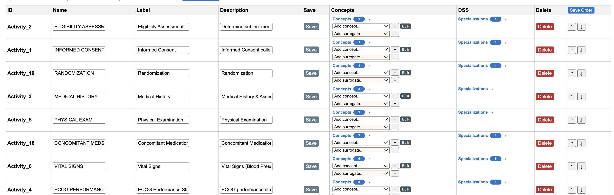

# Workflow for linking Biomedical Concept with Scheduled Activity Instance

Assumes that the Activties and Scheduled Activity Instances have been created to form the SOA Matrix.




## Assign Biomedical Concept to an Activity


Hovering the cursor over a Biomedical Concept (BC) will display the C code for the BC.


C25298 is the C Code for Systolic Blood Pressure.

In the DSS (Data Set Specialization) column, the SDTM DSS values corresponding to the C Code of the Biomedical Concept is automagically mapped in the background.  This is done using the CDISC Library API: https://api.library.cdisc.org/api/cosmos/v2/mdr/specializations/datasetspecializations?biomedicalconcept=C25298


Response:

```JSON
{
    "_links": {
        "datasetSpecializations": {
            "sdtm": [
                {
                    "href": "/mdr/specializations/sdtm/datasetspecializations/SYSBP",
                    "title": "Systolic Blood Pressure",
                    "type": "SDTM Dataset Specialization"
                },
                {
                    "href": "/mdr/specializations/sdtm/datasetspecializations/SYSBP_EXT",
                    "title": "Systolic Blood Pressure Extended",
                    "type": "SDTM Dataset Specialization"
                }
            ]
        },
        "self": {
            "href": "/mdr/specializations/datasetspecializations?biomedicalconcept=C25298",
            "title": "Dataset Specializations that specialize a Biomedical Concept",
            "type": "Dataset Specializations List"
        },
        "parentBiomedicalConcept": {
            "href": "/mdr/bc/biomedicalconcepts/C25298",
            "title": "Systolic Blood Pressure",
            "type": "Biomedical Concept"
        }
    },
    "name": "Dataset Specializations (latest version)",
    "label": "Dataset Specializations List"
}
```
The `href` attribute has the value **/mdr/specializations/sdtm/datasetspecializations/SYSBP**.  This is then used by the application to retrieve the SDTM data set specialization and corresponding data element concepts: https://api.library.cdisc.org/api/cosmos/v2/mdr/specializations/sdtm/datasetspecializations/SYSBP

Response:

```JSON
{
    "_links": {
        "parentBiomedicalConcept": {
            "href": "/mdr/bc/biomedicalconcepts/C25298",
            "title": "Systolic Blood Pressure",
            "type": "Biomedical Concept"
        },
        "parentPackage": {
            "href": "/mdr/specializations/sdtm/packages/2025-04-01/datasetspecializations",
            "title": "SDTM Dataset Specialization Package Effective 2025-04-01",
            "type": "SDTM Dataset Specialization Package"
        },
        "self": {
            "href": "/mdr/specializations/sdtm/datasetspecializations/SYSBP",
            "title": "Systolic Blood Pressure",
            "type": "SDTM Dataset Specialization"
        }
    },
    "datasetSpecializationId": "SYSBP",
    "domain": "VS",
    "shortName": "Systolic Blood Pressure",
    "source": "VS.VSTESTCD",
    "sdtmigStartVersion": "3-2",
    "sdtmigEndVersion": "",
    "variables": [
        {
            "name": "VSTESTCD",
            "isNonStandard": false,
            "codelist": {
                "conceptId": "C66741",
                "submissionValue": "VSTESTCD",
                "href": "https://evsexplore.semantics.cancer.gov/evsexplore/concept/ncit/C66741"
            },
            "assignedTerm": {
                "conceptId": "C25298",
                "value": "SYSBP"
            },
            "role": "Topic",
            "relationship": {
                "subject": "VSTESTCD",
                "linkingPhrase": "is the code for the value in",
                "predicateTerm": "IS_DECODED_BY",
                "object": "VSTEST"
            },
            "mandatoryVariable": true,
            "mandatoryValue": false,
            "comparator": "EQ"
        },
        {
            "name": "VSTEST",
            "isNonStandard": false,
            "codelist": {
                "conceptId": "C67153",
                "submissionValue": "VSTEST",
                "href": "https://evsexplore.semantics.cancer.gov/evsexplore/concept/ncit/C67153"
            },
            "assignedTerm": {
                "conceptId": "C25298",
                "value": "Systolic Blood Pressure"
            },
            "role": "Qualifier",
            "relationship": {
                "subject": "VSTEST",
                "linkingPhrase": "decodes the value in",
                "predicateTerm": "DECODES",
                "object": "VSTESTCD"
            },
            "mandatoryVariable": true,
            "mandatoryValue": false
        },
        {
            "name": "VSORRES",
            "dataElementConceptId": "C70856",
            "isNonStandard": false,
            "role": "Qualifier",
            "dataType": "integer",
            "length": 3,
            "relationship": {
                "subject": "VSORRES",
                "linkingPhrase": "is the result of the test in",
                "predicateTerm": "IS_RESULT_OF",
                "object": "VSTESTCD"
            },
            "mandatoryVariable": true,
            "mandatoryValue": false,
            "originType": "Collected",
            "originSource": "Investigator",
            "vlmTarget": true
        },
        {
            "name": "VSORRESU",
            "dataElementConceptId": "C49669",
            "isNonStandard": false,
            "codelist": {
                "conceptId": "C66770",
                "submissionValue": "VSRESU",
                "href": "https://evsexplore.semantics.cancer.gov/evsexplore/concept/ncit/C66770"
            },
            "assignedTerm": {
                "conceptId": "C49670",
                "value": "mmHg"
            },
            "role": "Qualifier",
            "relationship": {
                "subject": "VSORRESU",
                "linkingPhrase": "is the unit for the value in",
                "predicateTerm": "IS_UNIT_FOR",
                "object": "VSORRES"
            },
            "mandatoryVariable": true,
            "mandatoryValue": false,
            "vlmTarget": true
        },
        {
            "name": "VSSTRESC",
            "dataElementConceptId": "C70856",
            "isNonStandard": false,
            "role": "Qualifier",
            "dataType": "integer",
            "length": 3,
            "relationship": {
                "subject": "VSSTRESC",
                "linkingPhrase": "is the result of the test in",
                "predicateTerm": "IS_RESULT_OF",
                "object": "VSTESTCD"
            },
            "mandatoryVariable": false,
            "mandatoryValue": false,
            "vlmTarget": true
        },
        {
            "name": "VSSTRESN",
            "dataElementConceptId": "C70856",
            "isNonStandard": false,
            "role": "Qualifier",
            "dataType": "integer",
            "length": 3,
            "relationship": {
                "subject": "VSSTRESN",
                "linkingPhrase": "is the result of the test in",
                "predicateTerm": "IS_RESULT_OF",
                "object": "VSTESTCD"
            },
            "mandatoryVariable": false,
            "mandatoryValue": false,
            "vlmTarget": true
        },
        {
            "name": "VSSTRESU",
            "dataElementConceptId": "C49669",
            "isNonStandard": false,
            "codelist": {
                "conceptId": "C66770",
                "submissionValue": "VSRESU",
                "href": "https://evsexplore.semantics.cancer.gov/evsexplore/concept/ncit/C66770"
            },
            "assignedTerm": {
                "conceptId": "C49670",
                "value": "mmHg"
            },
            "role": "Qualifier",
            "relationship": {
                "subject": "VSSTRESU",
                "linkingPhrase": "is the unit for the value in",
                "predicateTerm": "IS_UNIT_FOR",
                "object": "VSSTRESN"
            },
            "mandatoryVariable": false,
            "mandatoryValue": false,
            "vlmTarget": true
        },
        {
            "name": "VSPOS",
            "dataElementConceptId": "C62164",
            "isNonStandard": false,
            "codelist": {
                "conceptId": "C71148",
                "submissionValue": "POSITION",
                "href": "https://evsexplore.semantics.cancer.gov/evsexplore/concept/ncit/C71148"
            },
            "valueList": [
                "PRONE",
                "SEMI-RECUMBENT",
                "SITTING",
                "STANDING",
                "SUPINE"
            ],
            "role": "Qualifier",
            "relationship": {
                "subject": "VSPOS",
                "linkingPhrase": "is the subject position during performance of the test in",
                "predicateTerm": "IS_SUBJECT_STATE_FOR",
                "object": "VSTESTCD"
            },
            "mandatoryVariable": false,
            "mandatoryValue": false,
            "comparator": "IN"
        },
        {
            "name": "VSLOC",
            "dataElementConceptId": "C13717",
            "isNonStandard": false,
            "codelist": {
                "conceptId": "C74456",
                "submissionValue": "LOC",
                "href": "https://evsexplore.semantics.cancer.gov/evsexplore/concept/ncit/C74456"
            },
            "valueList": [
                "BRACHIAL ARTERY",
                "CAROTID ARTERY",
                "DORSALIS PEDIS ARTERY",
                "FEMORAL ARTERY",
                "FINGER",
                "PERIPHERAL ARTERY",
                "RADIAL ARTERY"
            ],
            "role": "Qualifier",
            "relationship": {
                "subject": "VSLOC",
                "linkingPhrase": "specifies the anatomical location of the performance of the test in",
                "predicateTerm": "SPECIFIES",
                "object": "VSTESTCD"
            },
            "mandatoryVariable": false,
            "mandatoryValue": false,
            "comparator": "IN"
        },
        {
            "name": "VSLAT",
            "dataElementConceptId": "C25185",
            "isNonStandard": false,
            "codelist": {
                "conceptId": "C99073",
                "submissionValue": "LAT",
                "href": "https://evsexplore.semantics.cancer.gov/evsexplore/concept/ncit/C99073"
            },
            "subsetCodelist": "VSLAT_BP",
            "valueList": [
                "LEFT",
                "RIGHT"
            ],
            "role": "Qualifier",
            "relationship": {
                "subject": "VSLAT",
                "linkingPhrase": "further specifies the anatomical location in",
                "predicateTerm": "SPECIFIES",
                "object": "VSLOC"
            },
            "mandatoryVariable": false,
            "mandatoryValue": false,
            "comparator": "IN"
        },
        {
            "name": "VSDTC",
            "dataElementConceptId": "C82515",
            "isNonStandard": false,
            "role": "Timing",
            "relationship": {
                "subject": "VSDTC",
                "linkingPhrase": "is the date of occurrence for",
                "predicateTerm": "IS_TIMING_FOR",
                "object": "VSTESTCD"
            },
            "mandatoryVariable": true,
            "mandatoryValue": false
        }
    ]
}
```

## Assign Biomedical Concept Surrogate to an Activity

When a Biomedical Concept does not exist in the Library, there is a facility to create a Surrogate Concept to link to an Activity.

The USDM Implementation Guide describes Biomedical Concept Surrogates as:

_Surrogate BCs are a
placeholder mechanism for when a BC definition is not available. This allows the name of a test to be specified but
no further detail need be provided. Surrogates can contain a name and description pair for the concept required. A
reference field is also provided to allow for links to reference materials (e.g., a URL for an external resource)._

In order to map a Surrogate to an Activity, first create the Surrogate.


Once created, these Surrogates can be added to a Scheduled Activity Instance in the same way as Biomedical Concepts.


These Surrogates are shown in the USDM JSON associated with their Scheduled Activity Instances.

```JSON
{
    "id": "Activity_8",
    "extensionAttributes": [],
    "name": "CHEMISTRY LABS",
    "label": "Serum Creatinine, Electrolytes (K, Na, Cl, CO2), Ca, BUN, Albumin, Total Protein, Phosphorus, AST (SGOT), ALT (SGPT), Alkaline Phosphatase, Total Bilirubin, Magnesium, Uric Acid.",
    "description": "Serum Creatinine, Electrolytes (K, Na, Cl, CO2), Ca, BUN, Albumin, Total Protein, Phosphorus, AST (SGOT), ALT (SGPT), Alkaline Phosphatase, Total Bilirubin, Magnesium, Uric Acid.",
    "previousId": "Activity_24",
    "nextId": "Activity_25",
    "childIds": [],
    "definedProcedures": [],
    "biomedicalConceptIds": [
        "BiomedicalConcept_18",
        "BiomedicalConcept_19",
        "BiomedicalConcept_20",
        "BiomedicalConcept_21",
        "BiomedicalConcept_22",
        "BiomedicalConcept_64",
        "BiomedicalConcept_65",
        "BiomedicalConcept_66",
        "BiomedicalConcept_67",
        "BiomedicalConcept_68",
        "BiomedicalConcept_69",
        "BiomedicalConcept_70",
        "BiomedicalConcept_71",
        "BiomedicalConcept_72"
    ],
    "bcCategoryIds": [],
    "bcSurrogateIds": [
        "BiomedicalConceptSurrogate_1",
        "BiomedicalConceptSurrogate_8"
    ],
    "timelineId": null,
    "notes": [],
    "instanceType": "Activity"
    },
```

```JSON
"bcSurrogates": [
    {
    "id": "BiomedicalConceptSurrogate_1",
    "extensionAttributes": [],
    "name": "Magnesium Measurement",
    "label": "Magnesium Measurement (C64840)",
    "description": "A quantitative measurement of the amount of magnesium present in a sample.",
    "reference": "https://evsexplore.semantics.cancer.gov/evsexplore/concept/ncit/C64840",
    "notes": [],
    "instanceType": "BiomedicalConceptSurrogate"
    },
```

Since there is no C Code associated with the Biomedical Concept Surrogate, there are no corresponding Data Set Specialization defined so there is no automagic mapping as seen with the Library Biomedical Concepts.


